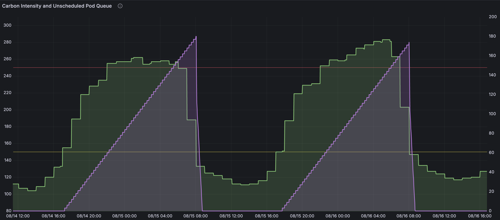

# Getting Started with Compute Gardener Scheduler: A Step-by-Step Guide

This tutorial will walk you through installing and using the Compute Gardener Scheduler to enable carbon-aware and price-aware workload scheduling in your Kubernetes cluster. The core carbon-aware scheduling functionality is configured in the first three steps, while additional features like price-aware scheduling, metrics visualization, and namespace policies are available as optional enhancements.

## Prerequisites

Before we begin, ensure you have:

- A Kubernetes cluster (v1.19+)
- Helm (v3.2.0+) installed
- `kubectl` configured to access your cluster
- Metrics Server installed (optional, for metrics gather)
- Prometheus installed (optional, for metrics visualization)

## Step 1: Installing Compute Gardener Scheduler

Let's start by adding the Helm repository and installing the scheduler:

```bash
# Add the Compute Gardener Helm repository
helm repo add compute-gardener https://elevated-systems.github.io/compute-gardener-scheduler
helm repo update

# Create a namespace for our installation
kubectl create namespace compute-gardener

# Install using Helm with the default configuration
# Replace YOUR_ELECTRICITY_MAP_API_KEY with your actual API key
helm install compute-gardener-scheduler compute-gardener/compute-gardener-scheduler \
  --namespace compute-gardener \
  --set carbonAware.electricityMap.apiKey=YOUR_ELECTRICITY_MAP_API_KEY
```

> 💡 **Note**: You'll need an Electricity Maps API key for carbon-aware scheduling. Good news - you can [sign up for a free account](https://portal.electricitymaps.com/?plan=free) that includes access to a single region's carbon intensity data, which is all you need to get started with carbon-aware scheduling!

After installation, verify that all components are running:

```bash
# Check the scheduler pod
kubectl get pods -n compute-gardener
```

You should see output similar to:

```
NAME                                          READY   STATUS    RESTARTS   AGE
compute-gardener-scheduler-7b9f66c878-lx4jv   1/1     Running   0          2m
```

## Step 2: Exploring the Sample Pod

The installation includes a sample pod to demonstrate the scheduler's functionality. Let's check it out:

```bash
# Get the sample pod
kubectl get pod compute-gardener-scheduler-sample-pod -n default
```

If the sample pod has been scheduled, you'll see something like:

```
NAME                                       READY   STATUS      RESTARTS   AGE
compute-gardener-scheduler-sample-pod      1/1     Running     0          2m
```

Let's examine the scheduling decisions:

```bash
# View the scheduling events for the sample pod
kubectl describe pod compute-gardener-scheduler-sample-pod -n default | grep -A 10 Events
```

In the events section, you might see:

```
Events:
  Type    Reason     Age   From                        Message
  ----    ------     ----  ----                        -------
  Normal  Scheduled  3m    compute-gardener-scheduler  Successfully assigned default/compute-gardener-scheduler-sample-pod to worker-1
```

This confirms that our pod was scheduled by the Compute Gardener Scheduler!

Let's also check the logs from the sample pod to confirm this:

```bash
# View logs from the sample pod
kubectl logs compute-gardener-scheduler-sample-pod -n default
```

You should see output that includes a line indicating which scheduler was used:


You've now completed the basic installation and verified that the scheduler is working. The next step will help you set up your first carbon-aware job, completing the core carbon-aware scheduling functionality.

## Step 3: Creating Your First Carbon-Aware Job

Now let's create a simple batch job that will benefit from carbon-aware scheduling:

```yaml
# Create a file named carbon-aware-job.yaml
apiVersion: batch/v1
kind: Job
metadata:
  name: carbon-aware-job
spec:
  backoffLimit: 2
  template:
    metadata:
      annotations:
        compute-gardener-scheduler.kubernetes.io/carbon-intensity-threshold: "200.0"
    spec:
      schedulerName: compute-gardener-scheduler
      restartPolicy: Never
      containers:
      - name: processor
        image: busybox:latest
        command:
        - /bin/sh
        - -c
        - |
          echo "Starting CPU-intensive workload..."
          for i in \$(seq 1 60); do
            echo "Processing batch \$i..."
            for j in \$(seq 1 100000); do
              echo "\$j" > /dev/null
            done
            sleep 2
          done
          echo "Workload complete!"
        resources:
          # It's critical to set appropriate requests/limits so that the rush of no longer delayed jobs doesn't saturate cluster resources.
          requests:
            memory: "64Mi"
            cpu: "100m"
          limits:
            memory: "128Mi"
            cpu: "500m"
```
```bash
# Apply the job
kubectl apply -f carbon-aware-job.yaml

# Watch its status
kubectl get job carbon-aware-job -w
```

You might notice that the job doesn't start immediately. If not, that is likely because the Compute Gardener Scheduler is waiting for better carbon intensity conditions based on our threshold (200 gCO2eq/kWh).

The scheduler does its job by delaying execution until carbon intensity drops below your threshold (or until the maximum delay is reached). This reduction in emissions happens automatically and immediately, with no further configuration required.

### Overriding Scheduling Delays (When Needed)

If you need to run your job immediately, regardless of carbon intensity conditions, you can easily override the scheduling delay by adding the `skip` annotation to the pod:

```bash
# Get the name of the pod created by the job
JOB_POD=$(kubectl get pods -l job-name=carbon-aware-job -o jsonpath='{.items[0].metadata.name}')

# Add the skip annotation directly to the pod
kubectl annotate pod $JOB_POD compute-gardener-scheduler.kubernetes.io/skip=true
```

With this annotation applied, the scheduler will process the pod on its next scheduling cycle (typically within 1-2 minutes), bypassing any carbon intensity thresholds.

**Important:** Even at this point, with just these three steps completed, your Compute Gardener Scheduler is now able to reduce your carbon footprint by making intelligent scheduling decisions. Every Compute Gardener scheduled workload that gets delayed during a high-carbon period and runs during a lower-carbon period represents real carbon emissions avoided - whether those savings are being tracked or not. The following steps are all optional and can be explored based on your specific interests or needs.

## Step 4: Monitoring the Scheduler's Decisions (Optional)

To see what's happening behind the scenes, let's check the scheduler logs:

```bash
# Get the scheduler pod name
SCHEDULER_POD=$(kubectl get pods -n compute-gardener -l component=scheduler -o jsonpath='{.items[0].metadata.name}')

# View the scheduler logs
kubectl logs -n compute-gardener $SCHEDULER_POD | grep -i "carbon intensity"
```

You might see output like:

```
2024-03-23T14:30:15.123Z INFO Current carbon intensity {"region": "US-CAL-CISO", "intensity": 245.6, "threshold": 200.0, "exceeds": true}
```

This means the current carbon intensity (245.6 gCO2eq/kWh) exceeds our threshold (200 gCO2eq/kWh), so the scheduler is delaying our job.

The following chart shows roughly two days of scheduler operation. The purple "staircase" is the scheduler queue depth. In normal cluster operation this is flat at zero. In normal Compute Gardener operation, it will increment whenever a new pod is delayed. In our case we're running a regularly scheduled CronJob, hence the regular staircase pattern. Your usage patterns, of course, may differ.

The green series is carbon intensity in the CalISO region. The queue depth rises when a job is triggered but carbon intensity is higher than the threshold.



If we wait for carbon intensity to drop below our threshold, or if we exceed the maximum scheduling delay (default: 24h), the job will eventually be started:

```bash
# Check if the job has started
kubectl get pods | grep carbon-aware-job
```

With the core carbon-aware scheduling functionality working, you can now see your scheduler making intelligent scheduling decisions based on carbon intensity.

## Step 5: Setting Up Time-of-Use Pricing Schedules (Optional)

The scheduler supports time-of-use (TOU) electricity pricing, allowing workloads to run during cheaper off-peak hours. This is completely optional but can provide significant cost savings.

```
# Update the scheduler to use the pricing schedules
helm upgrade compute-gardener-scheduler compute-gardener/compute-gardener-scheduler \
  --namespace compute-gardener \
  --set priceAware.enabled=true \
  --set carbonAware.electricityMap.apiKey=YOUR_ELECTRICITY_MAP_API_KEY
```
Helm will install a schedule like the following one. Use as-is or update based on your own needs.

```yaml
# Example Price Schedule ConfigMap
apiVersion: v1
kind: ConfigMap
metadata:
  name: compute-gardener-pricing-schedules
  namespace: compute-gardener
data:
  schedules.yaml: |
    schedules:
      # Monday-Friday peak pricing periods (4pm-9pm)
      - dayOfWeek: "1-5"
        startTime: "16:00"
        endTime: "21:00"
        peakRate: 0.30    # Peak electricity rate in $/kWh (optional: if known)
        offPeakRate: 0.10 # Off-peak electricity rate in $/kWh (optional: if known)
      # Weekend peak pricing periods (1pm-7pm)
      - dayOfWeek: "0,6"
        startTime: "13:00"
        endTime: "19:00"
        peakRate: 0.30    # Peak electricity rate in $/kWh (optional: if known)
        offPeakRate: 0.10 # Off-peak electricity rate in $/kWh (optional: if known)
```

The key parts of this configuration are the time periods - the scheduler will avoid scheduling during the specified peak periods. The actual rate values are optional and are primarily used for reporting and metrics.

## Step 6: Creating a Price-Aware CronJob (Optional)

Now, let's create a CronJob to demonstrate how TOU-based scheduling interacts with traditional time-based scheduling:

```yaml
# Create a file named price-aware-cronjob.yaml
apiVersion: batch/v1
kind: CronJob
metadata:
  name: price-aware-cronjob
spec:
  schedule: "0 * * * *"  # Run every hour
  concurrencyPolicy: Allow
  jobTemplate:
    spec:
      template:
        metadata:
          annotations:
            # Set max scheduling delay to 6 hours
            compute-gardener-scheduler.kubernetes.io/max-scheduling-delay: "6h"
        spec:
          schedulerName: compute-gardener-scheduler
          restartPolicy: OnFailure
          containers:
          - name: batch-processor
            image: busybox:latest
            command:
            - /bin/sh
            - -c
            - |
              echo "Running batch processing during off-peak hours..."
              for i in \$(seq 1 30); do
                echo "Processing data file \$i..."
                sleep 10
              done
              echo "Processing complete!"
            resources:
              requests:
                memory: "128Mi"
                cpu: "250m"
              limits:
                memory: "256Mi"
                cpu: "500m"
```
```bash
# Apply the CronJob
kubectl apply -f price-aware-cronjob.yaml
```

> 📢 **Important Note**: The CronJob's schedule (`0 * * * *`) is still used to trigger the job creation, but the actual pod execution might be delayed by the Compute Gardener Scheduler based on the time-of-use scheduling configuration. This means that while the CronJob will create a Job every hour as scheduled, the Job might wait for off-peak periods before running.
>
> This is a key feature of the Compute Gardener Scheduler - it works with standard Kubernetes time-based scheduling but adds intelligent time-of-use decisions on top. Your regularly scheduled jobs run during off-peak periods, not just when the clock says they should.

To verify our CronJob:

```bash
kubectl get cronjob price-aware-cronjob
```

## Step 7: Visualizing Metrics with Grafana (Optional)

If you have Prometheus and Grafana installed, you can visualize the scheduler's metrics to gain valuable insights into your carbon and energy savings. This step is entirely optional but provides a powerful way to quantify the benefits of your carbon-aware scheduling.

> ⚠️ **Note**: Energy usage tracking and detailed metrics visualization requires Prometheus and Grafana. Without these tools, you'll still get all the carbon and cost-saving benefits of intelligent scheduling, but you won't be able to measure and report on those savings.

To set up the Compute Gardener dashboard in Grafana:

```bash
# 1. Download the Grafana dashboard JSON from the repository
wget https://raw.githubusercontent.com/elevated-systems/compute-gardener-scheduler/main/dashboards/compute-gardener-dashboard.json

# 2. Import the dashboard to your Grafana instance:
# - In your Grafana UI, go to "Dashboards" -> "Import"
# - Upload the JSON file or paste its contents
# - Select your Prometheus data source
# - Click "Import"
```

Once imported, you can access the dashboard via Grafana UI.

You'll now have access to visualizations of carbon intensity, power use by pod and much more.


Specifically, the Compute Gardener dashboard in Grafana provides visualizations for:

1. **Carbon Intensity**: View real-time and historical carbon intensity data
2. **Scheduling Decisions**: See when workloads were delayed due to high carbon intensity
3. **Energy Savings**: Quantify the energy consumed during workload execution
4. **Carbon Emissions Avoided**: Calculate the carbon savings from intelligent scheduling
5. **Peak/Off-Peak Execution**: Track workloads scheduled during off-peak time periods

These visualizations help you demonstrate the environmental and cost benefits of your carbon-aware scheduling policies, providing tangible metrics for sustainability reporting.

## Step 8: Using Namespace-Level Energy Policies (Optional)

As an advanced feature, you can set up namespace-level defaults for energy policies:

```yaml
# Create a file named green-namespace.yaml
apiVersion: v1
kind: Namespace
metadata:
  name: green-compute
  labels:
    compute-gardener-scheduler.kubernetes.io/energy-policies: "enabled"
  annotations:
    # Default carbon intensity threshold
    compute-gardener-scheduler.kubernetes.io/policy-carbon-intensity-threshold: "200"
    
    # Different energy budgets for different workload types
    compute-gardener-scheduler.kubernetes.io/workload-batch-policy-energy-budget-kwh: "5"
    compute-gardener-scheduler.kubernetes.io/workload-service-policy-energy-budget-kwh: "10"
    
    # Default action when energy budget is exceeded
    compute-gardener-scheduler.kubernetes.io/policy-energy-budget-action: "notify"
```
```bash
# Apply energy policies to the namespace
kubectl apply -f green-namespace.yaml
```

Now, let's create a pod in this namespace:

```bash
# Create green-pod.yaml for a pod in the "green-compute" namespace
apiVersion: v1
kind: Pod
metadata:
  name: green-pod
  namespace: green-compute
spec:
  schedulerName: compute-gardener-scheduler
  containers:
  - name: app
    image: nginx:latest
    resources:
      requests:
        memory: "64Mi"
        cpu: "100m"
```
```bash
# Apply the pod
kubectl apply -f green-pod.yaml
```

Check if the namespace policies were applied:

```bash
# Check the pod annotations
kubectl get pod green-pod -n green-compute -o jsonpath='{.metadata.annotations}' | jq
```

You should see the carbon intensity threshold annotation applied automatically!

## Conclusion

Congratulations! You've successfully installed the Compute Gardener Scheduler and explored its features. The first three steps set up the core carbon-aware scheduling functionality, which is already reducing your carbon footprint even if you don't implement any of the optional features.

Your Kubernetes cluster is now more energy-efficient and cost-effective, automatically scheduling workloads during periods of lower carbon intensity and potentially during cheaper electricity periods if you enabled price-aware scheduling.

### Quick Summary of What We've Done:

1. **Core Setup** (Steps 1-3): Installing the scheduler, verifying it works, and setting up carbon-aware scheduling
2. **Advanced Monitoring** (Step 4): Observing scheduling decisions through logs
3. **Price-Aware Scheduling** (Steps 5-6): Configuring TOU pricing and optimizing CronJobs
4. **Monitoring and Policies** (Steps 7-8): Advanced metrics and namespace-level controls

**Important:** Even without sophisticated monitoring or metrics tracking, your carbon-aware scheduling is now working to reduce carbon emissions by delaying workloads during high-carbon periods, providing real environmental benefits regardless of whether they're being measured. Every decision to delay a workload until a lower-carbon period represents actual carbon emissions avoided - these savings are happening whether or not you're tracking the specific numbers.

## Next Steps

Depending on your interests, you might want to explore:

- Adjusting carbon and price thresholds based on your workload requirements
- Setting up Grafana dashboards to visualize energy usage and carbon savings
- Configuring hardware profiles to improve power estimation accuracy
- Exploring advanced features like GPU workload classification

Happy cleaner computing!